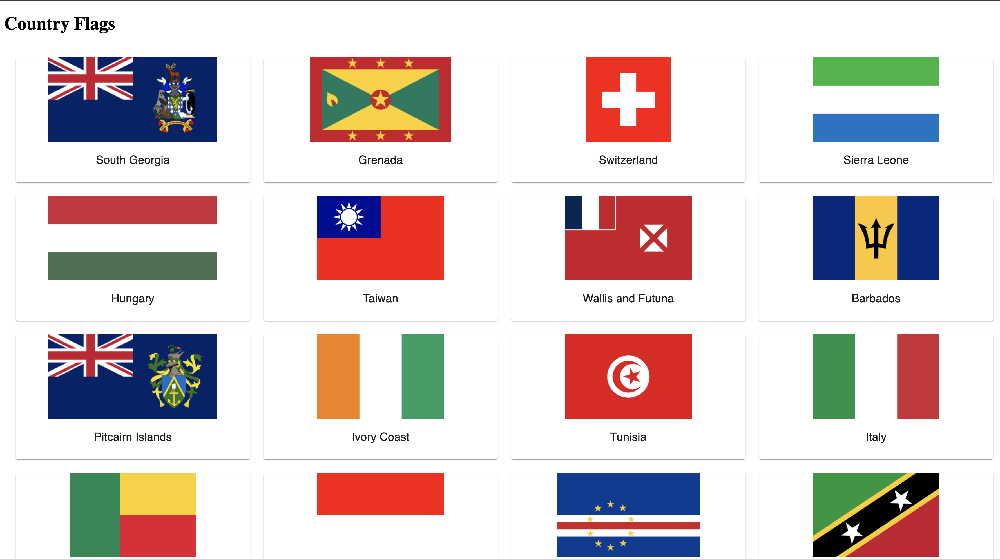
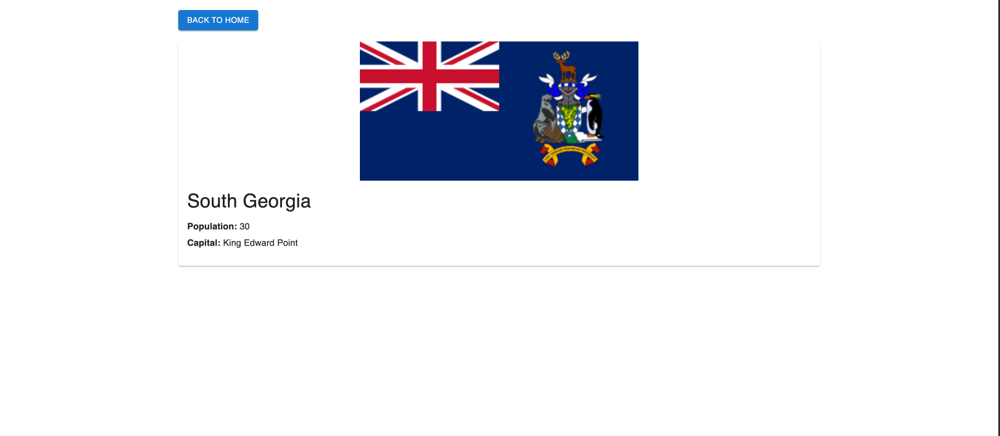
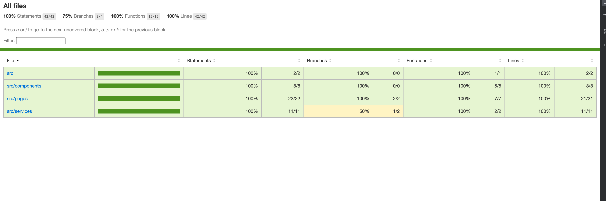
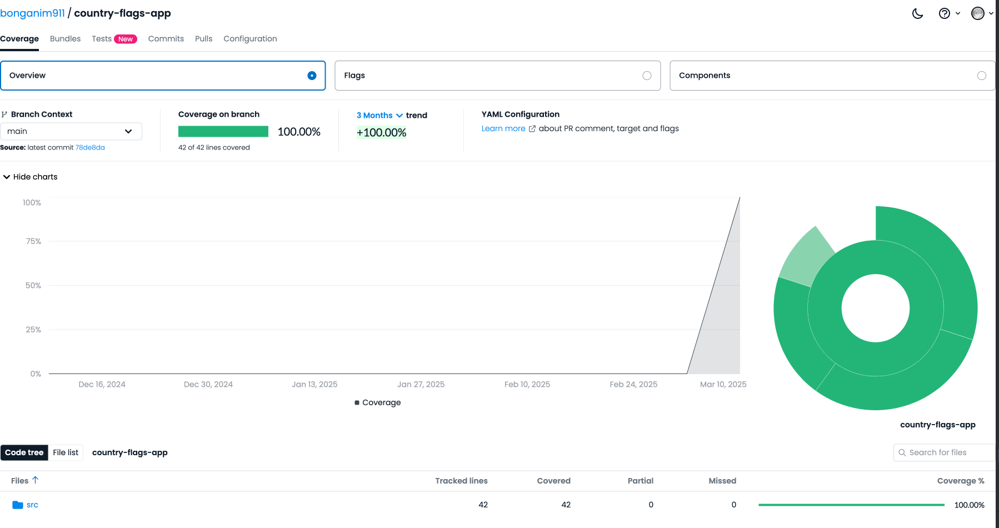

# Table of Contents

* [Country Application Project](#country-application-project)
    * [Minimum Requirements](#minimum-requirements)
* [Getting Started](#getting-started)
    * [Major Libraries / Tools](#major-libraries--tools)
    * [Checkout the Code](#checkout-the-code)
* [Setting up Prerequisites](#setting-up-prerequisites)
    * [Node.js Setup](#nodejs-setup)
    * [Run Application](#run-application)
* [Running Quality Gates and Build Commands](#running-quality-gates-and-build-commands)
    * [Static Code Analysis](#static-code-analysis)
    * [Unit Tests](#unit-tests)
    * [Code Coverage](#code-coverage)
    * [Build Project](#build-project)
    * [Published Code Coverage](#published-code-coverage)
* [CI/CD GitHub Actions](#cicd-github-actions)
* [API Documentation](#api-documentation)
* [Trade-offs](#trade-offs)

---

# Country Application Project

This is a ReactJS application that demonstrates a simple front-end, routing, and API integration (country-service api).

## Minimum Requirements

- Install [Git](https://www.atlassian.com/git/tutorials/install-git) (if you don't have it yet).
- Install [Node.js](https://nodejs.org/) (version 16 or higher recommended).

---

# Getting Started

This project was bootstrapped with [Create React App](https://create-react-app.dev/).

- If you are not already familiar with React, you may start with the [official React documentation](https://reactjs.org/docs/getting-started.html).

## Major Libraries / Tools

| Category                    | Library/Tool          | Link                                         |
|-----------------------------|-----------------------|----------------------------------------------|
| Core Framework              | React                 | https://reactjs.org/                        |
| State Management            | Redux                 | https://redux.js.org/                       |
| Routing                     | React Router          | https://reactrouter.com/                    |
| Styling                     | Mui Material CSS      | https://www.muicss.com/                                            |
| Testing Framework           | Jest                  | https://jestjs.io/                          |
| Testing Utilities           | React Testing Library | https://testing-library.com/docs/react-testing-library/intro/ |
| Code Coverage               | Istanbul              | https://istanbul.js.org/                    |
| Static Code Analysis        | ESLint                | https://eslint.org/                         |
| CI/CD                       | GitHub Actions        | https://github.com/features/actions         |

## Checkout the Code

```bash
git clone git@github.com:bonganim911/country-flags-app.git
cd country-flags-app
```

## Setting up Prerequisites
- Node.js Setup, Install Node.js and npm (Node Package Manager) from the official [Node.js website.](https://nodejs.org/)
- Backend API, details to set it up and run it [found here](https://github.com/bonganim911/country-service).


## Run Application
```bash
npm install 
npm start
```
Runs the app in development mode.
Open http://localhost:3000 to view it in the browser.


Details Page


# Running Quality Gates and Build Commands Static Code Analysis
```bash
npm run lint
```
Runs ESLint to analyze the code for potential issues.

### Unit Tests
```bash
npm test
```
Launches the test runner in interactive watch mode.

### Code Coverage
```bash
npm run test:coverage
```

# Code Coverage Report
Runs tests and generates a code coverage report.



 ### Build Project
```bash
npm run build
```
Builds the app for production to the build folder.

# Published Code Coverage
Codecov results and report are [available here](https://app.codecov.io/github/bonganim911/country-flags-app).


# CI/CD GitHub Actions
The GitHub Actions workflow runs on push to main or any feature branch.
- Builds the project.
- Runs static code analysis.
- Executes all tests.
- Generates and publishes code coverage results to Codecov.
- Builds and publishes a Docker image to Docker Hub.

# API Documentation
Our React app integrates with an API, document available on [backend service](https://github.com/bonganim911/country-service).

Trade-offs
- Fetching of flags information used Backend API not directly using Open API, since backend handle this function.
  - Not clear from requirements statement whether to fetch directly FE -> Open API or as its mentioned in overview to integrate with backend api.
- Performance:
  - Could have implemented Lazy loading to improve initial load time.
  - Did not optimize images or assets further due to project scope.
- Lint
  - Linting not working as expected on ci, due to time constraint decided to not run it on pipeline. But can be run on pre git push.